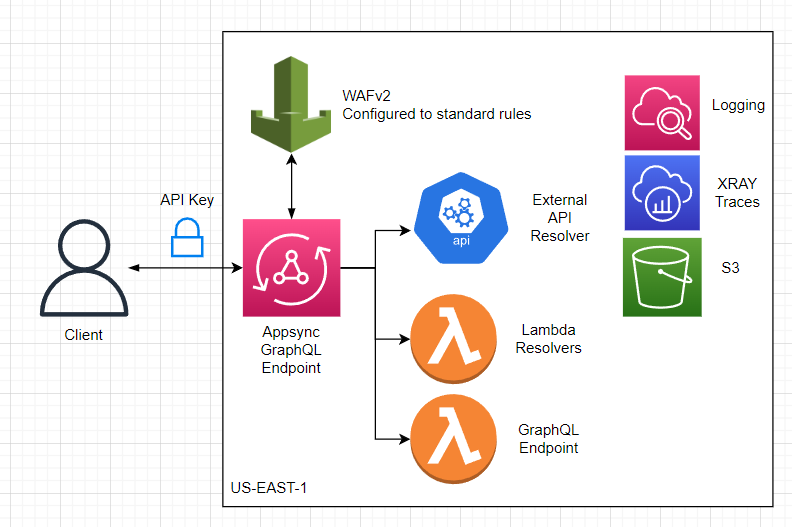

# AWS-GraphQL-Template
 

> A serverless template created as an example of GraphQL implementation in AWS Appsync. This includes WAFv2, Appsync, logging, and some other various services. Deployment of all infra is fully automated using serverless framework.

- [AWS-GraphQL-Template](#aws-graphql-template)
  - [Architecture](#architecture)
  - [Adding GraphQL Resolvers \& Data Sources](#adding-graphql-resolvers--data-sources)
  - [Modifying the GraphQL Schema](#modifying-the-graphql-schema)
  - [GraphQL Caching](#graphql-caching)
  - [Adding new lambdas](#adding-new-lambdas)
  - [Adding Environment Variables To Lambda](#adding-environment-variables-to-lambda)
  - [Deployment](#deployment)
  - [Dev Dependencies](#dev-dependencies)
  - [Contributing](#contributing)

## Architecture
Below is a single region deployment example. All resources here are automatically provisioned and configured via serverless framework and deployed to the configured region.
<br>

<br>

## Adding GraphQL Resolvers & Data Sources
In this example I included two data-source types. One of which is a return from `lambda`, and the other of which is a return from an `external api`. There are a bunch of other places you can fetch data from for graphql/appsync such as RDS, dynamo, etc. You can find documentation [here](https://github.com/sid88in/serverless-appsync-plugin). Simple add a datasource, connect a request/response resolver, and add the returned values (from response resolver) in the graphql schema!

## Modifying the GraphQL Schema
You can view the schema files in `/schemas`. Our serverless scripts merges them during build. You can read more about how that stitching works [here](https://github.com/sid88in/serverless-appsync-plugin/blob/master/doc/general-config.md#schema-stitching).

## GraphQL Caching
There are a few methods to cache request. Appsync has built in caching mechanism you can enable. Defaultly I have it disabled as it can run up cost and configured on a case by case basis. You can check out more about configuring caching in appsync via serverless [here](https://github.com/sid88in/serverless-appsync-plugin/blob/master/doc/caching.md).

## Adding new lambdas
Adding lambdas is fairly straight forward. Simply copy one of the lambda folders inside of `/src/lambdas/` and modify the handler code as needed. Once that is complete open `serverless.yml` and navigate to the `functions:` section. This is where we specify the file to use in that lambda as well as how it connects to appsync. 

Example config:
```yaml
functions:
  hello:
    handler: src/lambdas/hello/handler.handler #fileName.exportName in code
    maximumRetryAttempts: 1 #Retry attempts by lambda on failure
    package: # Only package code relevant to this specific lambda
      patterns:
        - src/lambdas/hello/**
```

For more documentation on how its configured, visit [HERE](https://www.serverless.com/framework/docs/providers/aws/guide/functions).

## Adding Environment Variables To Lambda
Environment variables can be added to our lambdas via `serverless.yml` under the `provider:`. An example is as follow:
```yaml
provider:
  environment:
    MY_SECRET: hi there :)
```
This will be accessible in the lambda via `process.env.MY_SECRET`. There are defaultly some environment variables accessible from AWS such as `process.env.AWS_REGION` for the current region

**Note**: Sensitive secrets should be stored via [Secret Manager](https://aws.amazon.com/secrets-manager/) which should be manually configured by you. To request secrets and data from the service you can utilize the [AWS SDK for JS](https://www.npmjs.com/package/aws-sdk) and follow this [example](https://www.internetkatta.com/how-to-use-secrets-manager-in-aws-lambda-node-js).


## Deployment
To deploy the application to AWS you will first need to install the [AWS CLI](https://docs.aws.amazon.com/cli/latest/userguide/getting-started-install.html). Then proceed with the following steps.

1. Authenticate with your AWS CLI. Whether that be entering access keys in the [credential file](https://docs.aws.amazon.com/cli/latest/userguide/cli-configure-files.html) or alternatively entering [environment variables](https://docs.aws.amazon.com/cli/latest/userguide/cli-configure-envvars.html).
2. Ensure your appsync schema is valid with `npm run validate-schema`
3. Once validated, run `npm deploy` which will use the default of stage `dev` and region `us-east-1`. If you wish to manually configure the stage and region, you can do so by modifying the `package.json` script or alternatively running `serverless deploy --stage dev --region us-east-1` manually with your respective changes to that commands parameters.

**IMPORTANT** : Due to the universal nature of s3, the deployment may fail with a "bucket already exist" error. This is because s3 buckets must have unique names _per region_. To resolve this ensure your service name is unique to your project or modify the deployment bucket name in the `serverless.yml` 

## Dev Dependencies
- serverless
- serverless-appsync-plugin
- serverless-deployment-bucket
- serverless-offline
- standard

## Contributing
Find the contribution document [HERE](/CONTRIBUTING.md) if you wish to work on the repo!